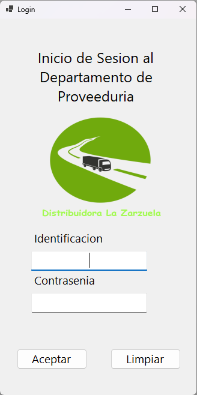

_Tarea Programada # 1_ 
# _<strong>Proveeduria Distribuidora La Zarzuela</strong>_  
IDE   _<strong>Visual Studio Comunity 2022</strong>_  
Framework:   _<strong>.NET 7</strong>_  

Objetivo del Proyecto:   Poner en uso los conocimientos adquiridos sobre desarrollo de aplicaciones con 
Visual Studio .Net y el <strong>lenguaje de programación C#</strong>; aplicando POO, desarrollo en capas,
manejo de archivos, validación de datos y manejo de errores.

Institucion:   _<strong>Colegio Universitario de Cartago</strong>_  

Profesor:   _<strong>Roger Rodrigez López</strong>_  

  _<strong>TI-131 Programación II     I Cuatrimestre, 2024</strong>_  
 

